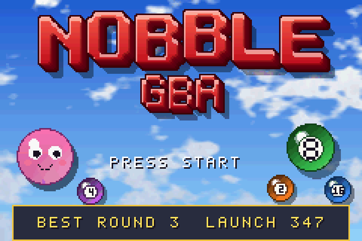
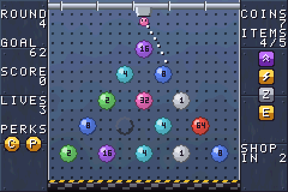
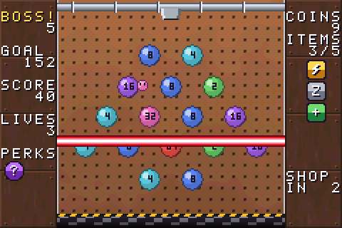
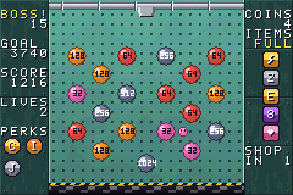
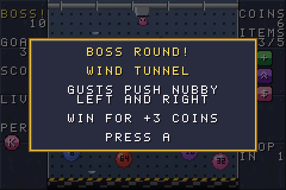
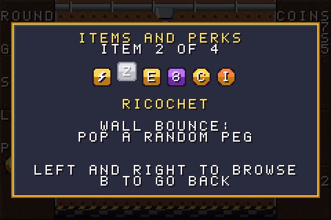

# Nobble GBA



A number-popping roguelike for the Game Boy Advance, loosely inspired by
*Nubby's Number Factory*. Aim Nobble from the launcher, bounce it off the walls
and pop the numbered pegs to hit each round's quota in a single launch.

| | |
| :---: | :---: |
|  |  |
| Aim with the dotted guide | Spend coins in the shop |
|  |  |
| Laser Grid boss wipes out a row | Armour Plating boss: steel pegs take a hit first |
|  |  |
| Every 5th round is a boss round | Check your items and perks from the pause menu |

> **Made with AI:** this game was built with [Claude](https://claude.ai), Anthropic's
> AI model, using Claude Code. The code, artwork, music and documentation were
> written by Claude, directed and playtested by [@hjcoggan](https://github.com/hjcoggan).
> See [AI disclosure](#ai-disclosure) below.

## How to play

- Aim the launcher at the top with **Left / Right** (L / R nudge one step) and
  press **A** to launch Nobble. The dotted line shows where it will go.
- Pegs hold powers of two. When Nobble hits a peg it **scores the peg's number
  and halves it**: 8 becomes 4, then 2, then 1, and a 1 pops and vanishes.
  Nobble bounces off pegs and the side walls until it falls into the shredder.
- Each round has a **quota**, a share of all the points left on the board.
  You must reach it **in a single launch**. Miss and you lose a life and the
  board resets for another try.
- Beat the quota and the board **restocks** once for every multiple of the
  quota you scored: pegs with the same number **merge in pairs** into one worth
  double, then empty slots fill with new pegs. Each restock pays a coin, and
  clearing a round restores a life. New pegs double in value every other
  round, so the numbers climb into the hundreds and thousands.
- The pegs sit in one of eight **layouts** (Classic, Diamond, Funnel, Columns,
  Ring, Pyramid, Zigzag, Scatter), 13 to 19 pegs each, with a new layout every
  3 rounds. Your biggest pegs move across to the new layout.
- Pop every peg on the board for a **perfect**: the launch scores double.
- Every 3 rounds there's a shop, and stronger items start turning up in
  later rounds. You can hold up to **5 items**, and each
  one fires on its own trigger. With all 5, buying another lets you swap out
  one you already have, and you get half its price back:

| Item | Trigger | Effect | Cost |
| --- | --- | --- | --- |
| Springs | Nobble falls out | Bounce back up (once per launch) | 6 |
| Seeder | On launch | Add a peg to an empty slot | 4 |
| Pump | On launch | Double the lowest peg | 5 |
| Zapper | First peg popped | Pop the highest peg | 5 |
| Doubler | First peg popped | Double a random peg | 5 |
| Ricochet | Wall bounce | Pop a random peg (up to 6 a launch) | 6 |
| Piggy | Peg popped away | 1 in 4 chance of a coin | 4 |
| Encore | Nobble falls out | +25% of the launch score | 6 |
| Chain | Every 8 pegs popped | Double a random peg | 5 |
| Big | Always | Nobble is bigger | 6 |
| Heart | Always | +1 life and +1 to your maximum | 7 |
| Merger | On launch | Merge the biggest matching pair of pegs | 6 |
| Spawner | Peg popped away | 1 in 3 chance: add a new peg | 5 |
| Payroll | Always | Restocks pay 2 coins instead of 1 | 6 |
| Scope | Always | A longer aim guide | 4 |
| Surge | Every 8 pegs popped | Pop 2 random pegs *(from round 4)* | 6 |
| Sniper | Wall bounce | Every third bounce pops the biggest peg *(from round 4)* | 6 |
| Alchemy | Peg popped away | Double the lowest peg *(from round 4)* | 6 |
| Overtime | Always | One extra restock when you beat the goal *(from round 7)* | 8 |
| Shield | Always | Your first miss each round costs no life *(from round 7)* | 9 |

- Every 5 rounds you choose one of two **perks** (up to 4), with rarer ones
  from round 10. Perks force items
  to fire, and an icon flashes whenever an item or perk goes off:

| Perk | When | What it triggers |
| --- | --- | --- |
| Conveyor | Every 3 seconds in flight | All items |
| Gremlin | Every second in flight | A random item |
| Ignition | First peg popped | 2 random items |
| Recycler | Nobble falls out | 50% chance: a random item |
| Bumper | Wall bounce | 1 in 4 chance: a random item |
| Payday | Passing the goal | All items |
| Jackpot | First pop is the biggest peg | 3 random items |
| Domino | 15 pegs popped | All items |
| Spark | On launch | 2 random items |
| Flurry | Every 5 pegs popped | A random item |
| Prism | Peg popped away | 1 in 3 chance: a random item |
| Cashback | Peg popped away | 1 in 5 chance: +1 coin |
| Whale | Hitting a peg worth 64 or more | A random item *(from round 10)* |
| Echo | An item fires | 1 in 4 chance it fires again *(from round 10)* |
| Finale | Nobble falls out | All items *(from round 15)* |

- Every 5th round is a **boss round** with a hazard on the board. Beat it for
  3 bonus coins:

| Boss | Hazard |
| --- | --- |
| Laser Grid | A laser locks onto a band of pegs, blinks a warning, then wipes it out |
| Wind Tunnel | Gusts push Nobble sideways, switching direction every 1.5 seconds |
| Armour Plating | Steel-grey pegs need one hit to crack the armour before they score |

- The music changes every 5 rounds (Factory Funk, Assembly Line, Overtime,
  Meltdown), and boss rounds have their own theme.

Press **Start** to pause. **Items and perks** in the pause menu lets you flick
through everything you own (left and right) to check what each one does.

Your furthest round and best single launch are saved to cartridge SRAM (a
`.sav` file in emulators).

## Building from source

You need [devkitPro](https://devkitpro.org)'s GBA toolchain, `make` and `git`.
Python 3 is only needed if you change the artwork (`make assets`).

### macOS

1. Download and run the devkitPro pacman installer (`.pkg`) from
   <https://github.com/devkitPro/pacman/releases>, then install the GBA tools:

   ```bash
   sudo dkp-pacman -S gba-dev
   ```

2. Add the toolchain to your shell (append to `~/.zshrc`, then `source ~/.zshrc`):

   ```bash
   export DEVKITPRO=/opt/devkitpro
   export DEVKITARM=$DEVKITPRO/devkitARM
   export PATH=$DEVKITPRO/tools/bin:$DEVKITARM/bin:$PATH
   ```

3. Install mGBA: `brew install --cask mgba`

4. Build and run:

   ```bash
   git clone https://github.com/hjcoggan/nobble-gba.git ~/nobble-gba
   cd ~/nobble-gba
   make
   open -a mGBA nobble-gba.gba
   ```

### Windows

1. Download the graphical installer (`devkitProUpdater`) from
   <https://github.com/devkitPro/installer/releases> and run it. When it asks
   which components to install, tick **GBA Development**. It installs to
   `C:\devkitPro` and sets the `DEVKITPRO`/`DEVKITARM` variables for you.

2. Open **MSYS2** from the devkitPro folder in the Start menu (a bash shell that
   comes with devkitPro, with `make` and `git`) and build:

   ```bash
   git clone https://github.com/hjcoggan/nobble-gba.git
   cd nobble-gba
   make
   ```

   If `git` is missing, install it with `pacman -S git`.

3. Install mGBA from <https://mgba.io/downloads.html> and open `nobble-gba.gba`
   with it (or drag the file onto the mGBA window).

### Linux

1. Install devkitPro pacman. On Debian, Ubuntu and derivatives:

   ```bash
   wget https://apt.devkitpro.org/install-devkitpro-pacman
   chmod +x ./install-devkitpro-pacman
   sudo ./install-devkitpro-pacman
   ```

   On Arch and other distros, follow
   <https://devkitpro.org/wiki/devkitPro_pacman>.

2. Install the GBA tools, then log out and back in (or run
   `source /etc/profile.d/devkit-env.sh`) so the environment variables are set:

   ```bash
   sudo dkp-pacman -S gba-dev
   ```

   On Arch-based systems the command is `sudo pacman -S gba-dev` after adding
   the devkitPro repositories.

3. Install mGBA: `sudo apt install mgba-qt`, or from Flathub with
   `flatpak install flathub io.mgba.mGBA`.

4. Build and run:

   ```bash
   git clone https://github.com/hjcoggan/nobble-gba.git
   cd nobble-gba
   make
   mgba-qt nobble-gba.gba
   ```

### Tests

The physics and game rules have host-side tests that build with your normal C compiler:

```bash
make test
```

## Project layout

```
source/main.c     Screens, input, HUD, numbered peg sprites, shop, menus, credits
source/game.c     Launch physics, popping pegs, quotas, restocks, items, perks, shop
source/sound.c    Music and sound effects on the GBA's PSG channels
source/ui.c       Text, panels and menus
source/save.c     Best round and score in SRAM
source/assets.c   Generated: palettes, background images, sprites, font
tools/gen_assets.py  Draws all artwork and writes assets.c/assets.h plus
                     build/preview_*.png
tests/            Host-side tests for the game logic
```

No libraries are needed beyond devkitARM. After editing the artwork in
`tools/gen_assets.py`, run `make assets`.

## AI disclosure

Nearly everything in this repository was generated by Claude (Anthropic) in
Claude Code sessions: the C source, the build setup, the tests, the procedural
artwork generator, the music and sound effects, and this README. A human chose
the features, played the builds and reported what to change. Commits written
this way carry a `Co-Authored-By: Claude` trailer.

The code has host-side tests for the physics and game rules, but it has not
been reviewed line by line by a person, so expect rough edges. Bug reports and
pull requests are welcome.

## License

[MIT](LICENSE) - do whatever you like with it. All code, art and music in this
repo is original; the artwork is generated by `tools/gen_assets.py`.

This is an unofficial fan project inspired by *Nubby's Number Factory*. It is
not affiliated with or endorsed by MogDogBlog Productions.
